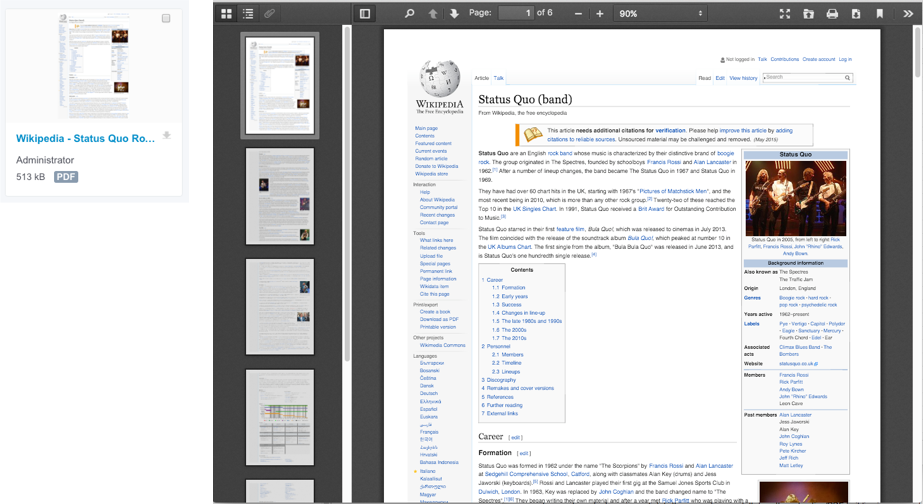

# nuxeo-webpage-archiver

Given a URL to a web page, the plugin builds a pdf from this webpage.

If the PDF is then saved in a document, you benefit of all the default features of Nuxeo: Full text extraction, Thumbnail, Preview... For example, the following screenshot shows the thumbnail and the PDF preview after building a pdf from the URL "https://en.wikipedia.org/wiki/Status_Quo_(band)":



* [Operations](#operations)
* [Command Line Contributions](command-line-contributions)
* [Examples](#examples)
* [Authentication](#authentication)
* [Install the Operations in your Studio Project](#install-the-operations-in-your-studio-project)
* [Limitations](#limitations)
* [Build](#build)
* [License](#license)
* [About Nuxeo](#about-nuxeo)


### Operations
The plug-in provides the following operations:

* `Conversion > Webpage to Pdf` (id `WebpageToPdf`)
  * _Input_: `void`
  * _Output_: A blob, the PDF corresponding to the webpage
  * _Parameters_:
    * `commandLine`: Optional.
      * The command line (XML contribution in your Studio project). See the default command lines for an example of use. You can declare your own command line, with more or less parameters, depending on the exact rendition you want to have (see [Command Line Contributions](command-line-contributions).
      * If not passed and `cookieJar` is èmpty, the default "wkhtmlToPdf" command line is used.
      * If not passed and `cookieJar` is èmpty, the default "wkhtmlToPdf-authenticated" command line is used.
    * `url`: Required. The url to use. Full URL with protocol, required
    * `fileName`: Optional. The file name for the pdf. Optional. A name built from the host in the URL is provided by default (`"http://my.site.com/more/and/more/page.html"` => `my-site-com.pdf`).
    * `cookieJar`: Optional. The blob returned by the `WebpageToBlob.Login` operation when accessing pages requiring authentication.
    * `timeoutMillisecs`: Optional. Number of milliseconds to wait before forcing wkhtmltopdf to quit. Default value is 30000.
  * This operation runs _synchronously_.

* `Conversion > Webpage to Document` (id `WebpageToDocument`)
  * _Input_: `Document`, the document in which the PDF will be stored
  * _Output_: The `Document` as received in input
  * _Parameters_:
    * `commandLine`: Optional.
      * The command line (XML contribution in your Studio project). See the default command lines for an example of use. You can declare your own command line, with more or less parameters, depending on the exact rendition you want to have (see [Command Line Contributions](command-line-contributions).
      * If not passed and `cookieJar` is èmpty, the default "wkhtmlToPdf" command line is used.
      * If not passed and `cookieJar` is èmpty, the default "wkhtmlToPdf-authenticated" command line is used.
    * `url`: The url to use. Full URL with protocol, required
    * `fileName`: The file name for the pdf. Optional. A name built from the host in the URL is provided by default (`"http://my.site.com/more/and/more/page.html"` => `my-site-com.pdf`).
    * `xpath`: The xpath to use to store the blob. Optional (`file:content` by default)
    * `cookieJar`: Optional. The blob returned by the `WebpageToBlob.Login` operation when accessing pages requiring authentication.
    * `timeoutMillisecs`: Optional. Number of milliseconds to wait before forcing wkhtmltopdf to quit. Default value is 30000.
  * This operation runs **a**_synchronously_, and returns immediately the same document. It does the extraction/PDF-building in an asynchronous worker, and when the conversion is done, it stores the resulting PDF in the `xpath` field and send the `webpageArchived` event (so you can install a listener for this event and be notified once the PDF was generated and stored in the Document). In the worker, 3 attempts are made to build the pdf in case of failure (timout, other error, ...)

* `Conversion > Webpage to Pdf: Login` (id `WebpageToBlob.Login`)
  * _Input_: `void`
  * _Output_: A blob, the _cookie jar_ to use as parameter of other operations when a accessing pages requring authentication.
  * _Parameters_:
    * `commandLine`: Required. The command line to use for authentication. See below "Authentication".
    * `timeoutMillisecs`: Optional. Number of milliseconds to wait before forcing wkhtmltopdf to quit. Default value is 30000.
  * This operation runs _synchronously_.

### Command Line Contributions
The plug-in contributes the CommandeLine Service by adding some commands, used by default. See their definition in nuxeo-webpage-archiver-plugin/src/main/resources/OSGI-INF/commandlines.xml.

By default, the command line uses `wkhtmltopdf` with the following switches:

* `-q`, to make a quiet call, with no risk to have problem with the output buffer
* `--load-media-error-handling ignore` and `--load-error-handling ignore`, to avoid freezing the command line in some complex pages.

You can easily contribute your own, custiom command line, using more and more wkhtmltopdf switches to fine tune the result. There is one variable that you must _always_ declare in your contribution, because it is expected at runtime: `"#{targetFilePath}"`. It must be used as is, as the last parameter, and please _must_ be quoted.

You could hard-code the URL of the page, but if you keep it as parameter, you then must add the `"#{url}"` variable. It _must_ be quoted.

Then, if you cutsomize a command line requiring authentication, you must add `--cookie-jar #{cookieJar}"`, literally, in your command line. This one too _must_ be quoted.

Last but not least, we stringly recommend using the `-q` parameter.

Here is an example of custom contribution added to the "XML Extension" in a Studio project. It just asks the PDF to be built in `Landscape` mode (instead of the default `Portrait`) and `Letter` size (instead of the default value, `À4`):

```xml
<extension
  target="org.nuxeo.ecm.platform.commandline.executor.service.CommandLineExecutorComponent"
  point="command">
  <command name="wkhtmlToPdf-Landscape" enabled="true">
    <commandLine>wkhtmltopdf</commandLine>
    <parameterString>-q --orientation Landscape --page-size Letter --load-media-error-handling ignore --load-error-handling ignore "#{url}" "#{targetFilePath}"</parameterString>
    <installationDirective>You need to install wkhtmltopdf</installationDirective>
  </command>
</extension
```

You can now pass this "wkhtmlToPdf-Landscape" command to an operation.


### Examples

_(see below "Install the Operations in your Studio project")_
    
#### Convert and Download from the User Interface, Synchronously

Say the URL is stored in the `myinfo:url` field of the current document. We use a timeout of 10 seconds:

    Fetch > Context Document(s)    
    Conversion > Webpage to Pdf
      url: @{Document["myinfo:url"]}
      fileName:
      timeoutMillisecs: 10000
    User Interface > Download File

#### Asynchronously Convert and Save in the Document

Say the URL is stored in the `myinfo:url` field of the current document:

    Fetch > Context Document(s)
    Conversion > Webpage to Document
      url: @{Document["myinfo:url"]}
      fileName:
      xpath: file:content

If you want to be notified once the work is done:

1. Add the "webpageArchived" event to the Core Events Registry:
<pre>
{
  "events": {
    "webpageArchived": "webpageArchived"
  }
}
</pre>

2. Create a new Event Handler for this event, and bind it to an automation chain. For example, you could send an email once the pdf is generated.

#### Synchronously Convert and Save in the Document

In previous example, we used the asynchronous `Conversion > Webpage to Document` operation. But we can just use `Conversion > Webpage to PDF` and save the returned PDF in the document. For example:

    Fetch > Context Document(s)
    Push & Pop > Push Document
    Conversion > Webpage to Pdf
      url: @{Document["myinfo:url"]}
      fileName:
    Context > Set Context Variable From Input
      name: the PDF
    Push & Pop > Pop Document
    Document > Set File
      file: @{thePDF)
      save: true
      XPath: file:content

#### With Authentication: Convert and Download from the User Interface, Synchronously
(Assuming you created the "myCommandLine-login" contribution - see below "Authentication")

    Conversion > Webpage to PDF: Login
      commandLine: myCommandLine-login
    Context > Set Context Variable From Input
      name: theCookieJar
    Conversion > Webpage to Pdf
      url: @{Document["myinfo:url"]}
      fileName:
      cookieJar: @{theCookieJar}
    User Interface > Download File


### Authentication

#### Main Principles
To convert to PDF a page requesting authentication, you must:

* Declare an XML contribution, contributing the command line service with all the information required to login (see below)
* Use this command line in the `Conversion > Webpage to Pdf: Login` operation. It returns a _cookie jar_ as a blob
* Use this blob in the `cookieJar` parameter of `Conversion > Webpage to Pdf` or `Conversion > Webpage to Document` operation.
* The same cookie jar can be used for several pages.

#### Command Line to Create
Gettng the pdf from a page requesting authenticaiton is kind of a challenge, since `wkhtmltopdf` is like a faceless browser. But it can be done. To understand the concept and how to find the exact parameters to pass to the command line, you must read the  wkhtmltopdf documentation, and also (mainly, actually) [this blog](http://test-mate.blogspot.com/2014/07/wkhtmltopdf-generate-pdf-of-password.html). The blog explains how to get the exact names of the variables you need to login.
For example, to access a page at http://my.url.com, you first have a login page. You must then:

* Get the info to be sent in `--post` values by wkhtmltopdf. Which means, the _variables_ sent in the form, in the POST request made by wkhtmltopdf.
* Add each of them to your commandline XML
* In the command line, you must:
  * Hard code the URL and all the `--post` information
  * Use the `#{cookieJar}` parameter (_must be set_,filled by the plug-in, do not change this name)
  * Use the `#{targetFilePath}` parameter (_must be set_,filled by the plug-in, do not change this name)

So, say the form variables to send are "user_name", "user_pwd" and the submit button is "Submit", with a value of "doLogin". You must have the following command:

```xml
<extension target="org.nuxeo.ecm.platform.commandline.executor.service.CommandLineExecutorComponent"
		   point="command">
  <command name="wkhtmlToPdf-login-EXAMPLE" enabled="true">
    <commandLine>wkhtmltopdf</commandLine>
    <parameterString>-q --cookie-jar #{cookieJar} --post user_name johndoe --post user-pwd 123456 --post Submit doLogin "http://my.site.com/login" "#{targetFilePath}"</parameterString>
  </command>
</extension>
```


### Install the Operations in your Studio Project

To use the operations in your project, you must add their definitions to the "Automation Operations Registry".

To do get the JSON definition, first install the plug-in in your server. Once started and authenticated, go to {yourserver:port}/nuxeo/site/automation/doc, find the operations, and get their JSON definition. Then, past them in the "Operations Registry" of your Studio project.

### Limitations

* The plug-in requires the `wkhtmltopdf` command line tool to be installed on your server. Please visit [http://wkhtmltopdf.org](http://wkhtmltopdf.org).
* Some webpages can be complicated, with complex css, can contain errors, etc. To avoid the command line to block and, possibly, freeze, it is used with options forcing it to ignore errors (see OSGI-INF/commandLInes.xml), such as
`--load-media-error-handling ignore` and `--load-error-handling ignore</code>`.


### Build

    cd /path/to/nuxeo-webpage-archiver
    mvn clean install    

*NOTE* As of today, unit test are OK in Eclipse, not in Maven. So better run:

    cd /path/to/nuxeo-webpage-archiver
    mvn clean install -DskipTests 


## License

[Apache License, Version 2.0](http://www.apache.org/licenses/LICENSE-2.0)

## About Nuxeo

Nuxeo provides a modular, extensible Java-based [open source software platform for enterprise content management](http://www.nuxeo.com) and packaged applications for Document Management, Digital Asset Management and Case Management. Designed by developers for developers, the Nuxeo platform offers a modern architecture, a powerful plug-in model and extensive packaging capabilities for building content applications.
